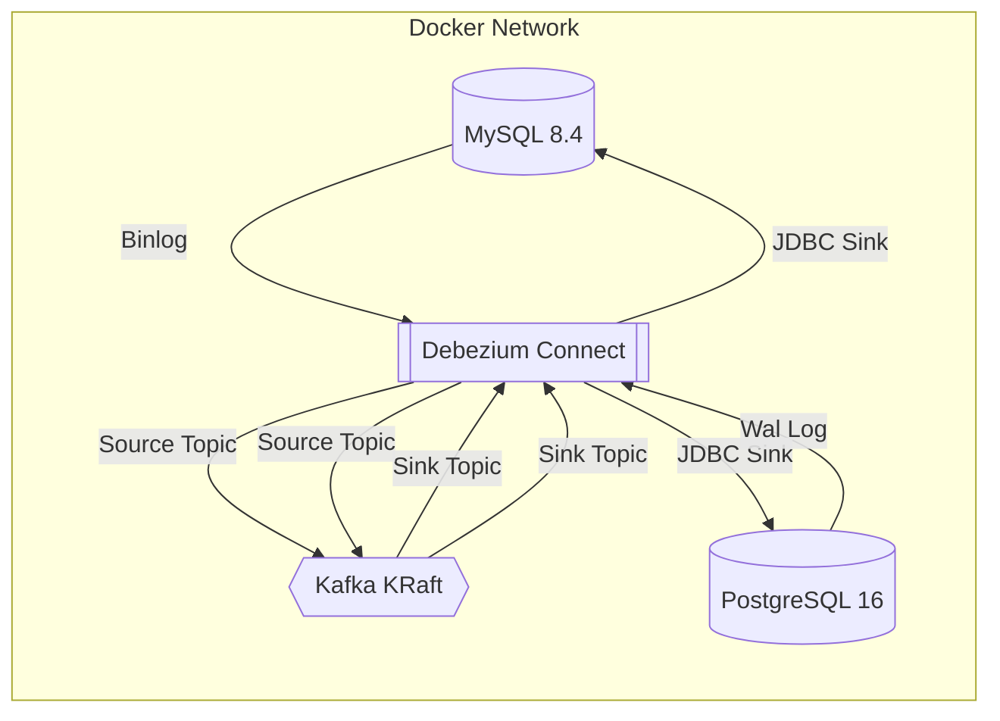

# Bidirectional CDC: MySQL - PostgreSQL with Debezium

A production-ready example of Bidirectional Change Data Capture (CDC) between MySQL and PostgreSQL using Debezium, Kafka (KRaft mode), and the JDBC Sink Connector.

This project demonstrates how to keep two heterogeneous databases in sync in real-time, preventing replication loops.

## Key Features

*   **Bidirectional Sync**: MySQL -> PostgreSQL and PostgreSQL -> MySQL.
*   **Loop Prevention**: Uses topic routing and `table.include.list` to prevent infinite replication loops.
*   **Modern Stack**:
    *   **Kafka KRaft**: No ZooKeeper required.
    *   **Debezium 3.0**: Latest connectors.
    *   **Dockerized**: Full stack in one compose file.
*   **Monitoring**: Includes **Kafka UI** for easy topic and message inspection.

## Architecture



## Prerequisites

*   Docker & Docker Compose installed.
*   `curl` and `jq` (optional, for easy connector deployment).

## Configuration

| Service | Host Port | Internal Port | User | Password | Database |
| :--- | :--- | :--- | :--- | :--- | :--- |
| **MySQL** | `3307` | `3306` | `root` | `dummy` | `no_temporal_extensions` |
| **PostgreSQL** | `5433` | `5432` | `postgres` | `dummy` | `no_temporal_extensions` |
| **Kafka UI** | `8080` | `8080` | - | - | - |
| **Kafka Connect**| `8083` | `8083` | - | - | - |

> **Note**: Passwords are set to `dummy` for this learning environment.

## Quick Start

### 1. Start the Environment

```bash
docker compose -f docker-compose-debezium-mp.yaml up -d --build
```

Wait for the `connect` service to be ready (usually ~30-60 seconds). You can check status:
```bash
curl -s http://localhost:8083/
```

### 2. Deploy Connectors

We use 4 connectors: 2 sources (to read changes) and 2 sinks (to write changes).

```bash
# Deploy all connectors at once
for f in connectors/*.json; do 
  curl -X POST http://localhost:8083/connectors \
  -H "Content-Type: application/json" -d @$f
done
```

### 3. Verify Deployment

Check that all 4 connectors are `RUNNING`:

```bash
curl -s "http://localhost:8083/connectors?expand=status" | jq '.[] | {name: .status.name, state: .status.connector.state}'
```

## Testing Replication

### MySQL -> PostgreSQL

1.  **Insert** data into MySQL:
    ```bash
    docker exec mysql mysql -u root -pdummy -e \
      "USE no_temporal_extensions; INSERT INTO supplier VALUES (100, 'MySQL Origin', 'test@mysql.com');"
    ```

2.  **Verify** it appears in PostgreSQL:
    ```bash
    docker exec postgres psql -U postgres -d no_temporal_extensions -c \
      "SELECT * FROM from_mysql_supplier WHERE supplier_id = 100;"
    ```

### PostgreSQL -> MySQL

1.  **Insert** data into PostgreSQL:
    ```bash
    docker exec postgres psql -U postgres -d no_temporal_extensions -c \
      "INSERT INTO warehouse VALUES (100, 'PG Origin', 'PG Location');"
    ```

2.  **Verify** it appears in MySQL:
    ```bash
    docker exec mysql mysql -u root -pdummy -e \
      "USE no_temporal_extensions; SELECT * FROM from_postgres_warehouse WHERE warehouse_id = 100;"
    ```

## Loop Prevention Strategy

To avoid infinite loops (A update -> B update -> A update ...), we use a filtered approach:

1.  **Source Connectors**: Only capture changes from the **original** tables (`supplier`, `warehouse`, etc.). We explicitly exclude the replicated tables using `table.include.list`.
2.  **Sink Connectors**: Write to **prefixed** tables (e.g., `from_mysql_supplier`, `from_postgres_warehouse`).

This creates a clear unidirectional flow for each row of data:
*   Original Table (MySQL) -> `from_mysql_` Table (Postgres)
*   Original Table (Postgres) -> `from_postgres_` Table (MySQL)

## Project Structure

*   `docker-compose-debezium-mp.yaml`: Definition of all services.
*   `connectors/`: JSON configuration files for Debezium connectors.
*   `mysql/` & `postgresql/`: Dockerfiles and schema scripts.
*   `connect/`: Custom Dockerfile for Kafka Connect (downloads JDBC drivers).

## Troubleshooting

*   **Connectors Failed?** Check logs:
    ```bash
    docker logs connect
    ```
*   **Restart a connector**:
    ```bash
    curl -X POST "http://localhost:8083/connectors/mysql-sink/restart?includeTasks=true"
    ```
*   **Reset everything**:
    ```bash
    docker compose -f docker-compose-debezium-mp.yaml down -v
    ```
